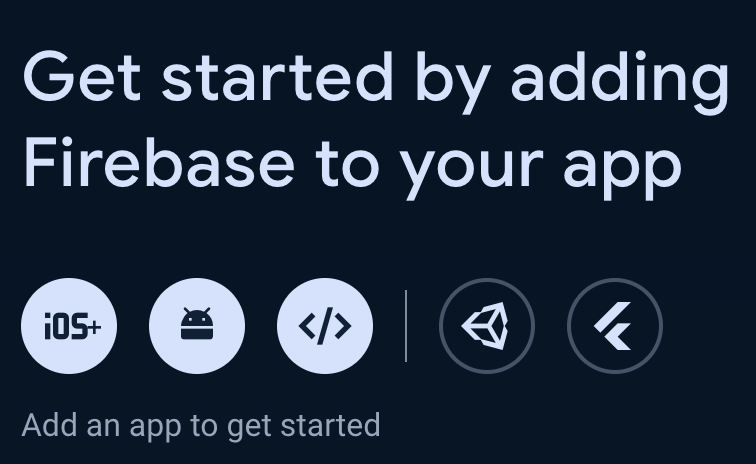
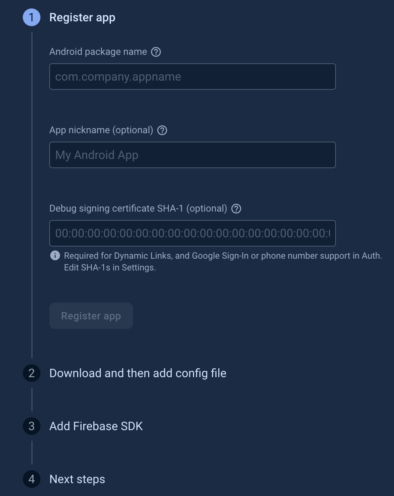
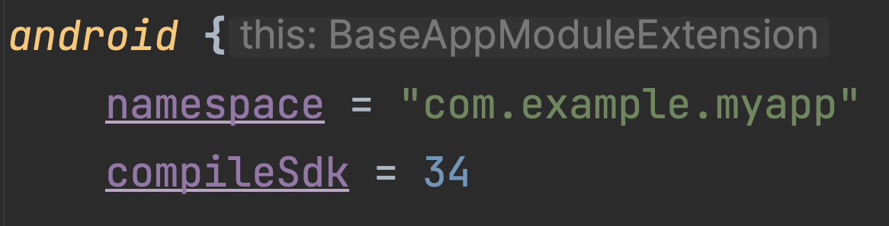
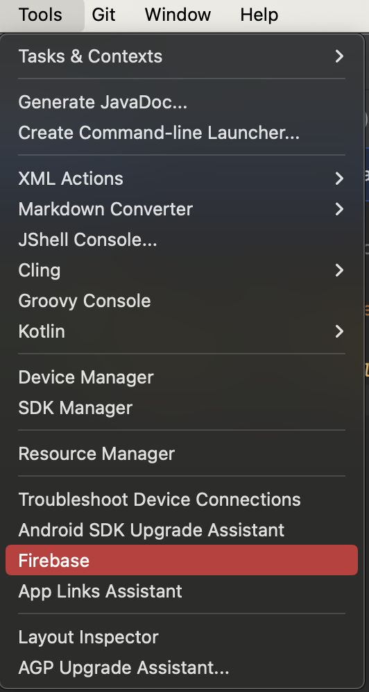
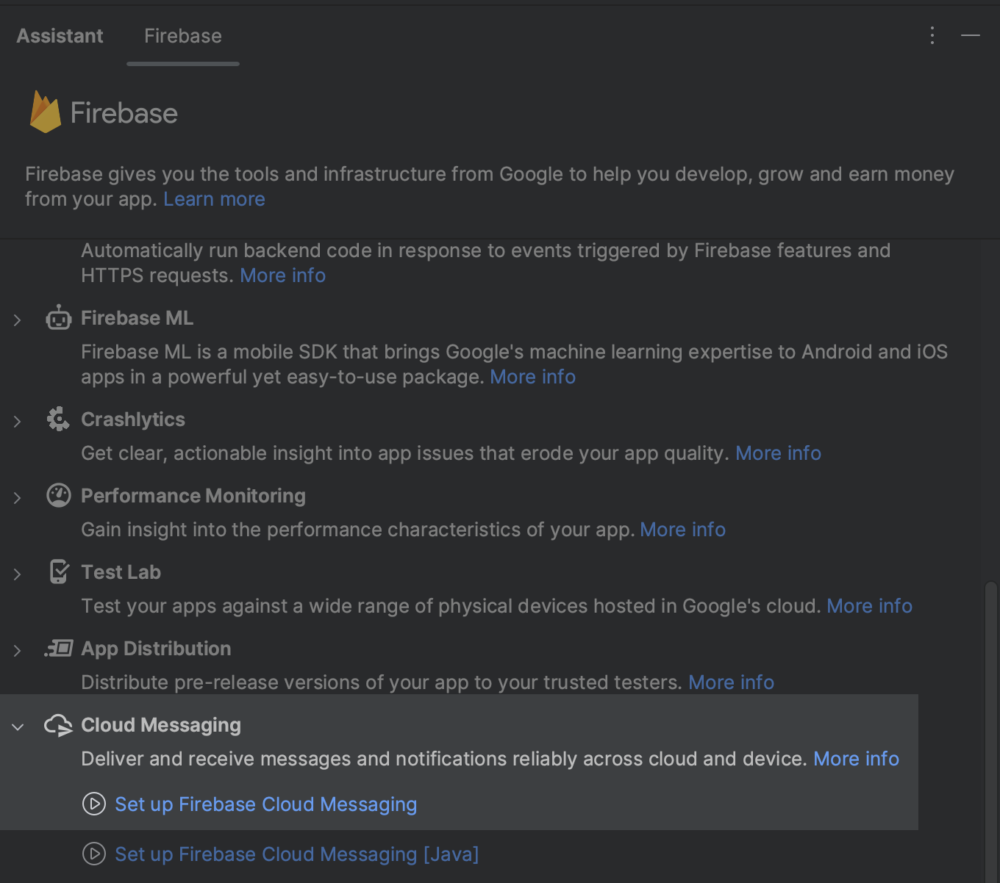

#
> [!NOTE]
> The contents of this readme were created using Android Studio Hedgehog | 2023.1.1 Build #AI-231.9392.1.2311.11076708, compiled on November 9, 2023.

[Set up a Firebase Cloud Messaging client app on Android](#set-up-a-firebase-cloud-messaging-client-app-on-android) \
    - [Option 1: Add Firebase using the Firebase console](#option-1-add-firebase-using-the-firebase-console-mostly-manual) \
    - [Option 2: Add Firebase using the Firebase Assistant](#option-2-add-firebase-using-the-firebase-assistant-mostly-automated) 

## Set up a Firebase Cloud Messaging client app on Android
### Option 1: Add Firebase using the Firebase console (mostly manual).

> [!NOTE]
> Assuming you already have a google account and firebase account. The following covers official video instructions from Firebase youtube channel: [Getting started with Firebase on Android](https://youtu.be/jbHfJpoOzkI)

1. Go to the [Firebase console](https://console.firebase.google.com/).

    - In the center of the project overview page, click the Android icon or Add app to launch the setup workflow
    

    - Enter your app's package name in the Android package name field (_This field is the only mandatory one, if you are not sure how to fill other fields - just don't_)
    

> [!WARNING]
> Make sure to enter the package name that your app is actually using. The package name value is case-sensitive, and it cannot be changed for this Firebase Android app after it's registered with your Firebase project.

> [!TIP]
> Find your app's package name in your module (app-level) Gradle file, usually app/build.gradle (example package name: com.yourcompany.yourproject)



2. Click **Register app**.

3. Download and add a Firebase configuration file.
    - Download and then add the Firebase Android configuration file `(google-services.json)` to your app
    - Move your config file into the **module (app-level)** root directory of your app

> [!TIP]
>  Your typical path should look like this `.../AndroidStudioProjects/your_app_name/app/google-services.json`

4. Install dependencies

    Filename: `build.gradle.kts` (Module :app). This is your module (app-level).
    ```kotlin
    plugins {
        // ...
        // Add the Google services Gradle plugin
        id("com.google.gms.google-services")
    }

    dependencies {
    // ...
    // Import the Firebase BoM
    implementation(platform("com.google.firebase:firebase-bom:32.7.0"))

    // When using the BoM, you don't specify versions in Firebase library dependencies
    // If you want analytics enabled: Add the dependency for the Firebase SDK for Google Analytics
    implementation("com.google.firebase:firebase-analytics")
    }
    ```

    Filename: `build.gradle.kts` (Project \<your app name>\). This is your root-level (project-level).
    ```kotlin
    plugins {
        // ...
        // Add the dependency for the Google services Gradle plugin
        id("com.google.gms.google-services") version "4.4.0" apply false
    }
    ```

### Option 2: Add Firebase using the Firebase Assistant (mostly automated).

> [!TIP]
> As per Firebase documentation: _The Firebase Assistant registers your app with a Firebase project and adds the necessary Firebase files, plugins, and dependencies to your Android project — all from within Android Studio!_

1. Open your Android project in Android Studio, then make sure that you're using the latest versions of Android Studio and the Firebase Assistant:

    Windows / Linux: \
    **Help** > **Check for updates**

    macOS: \
    **Android Studio** > **Check for updates**

2. Open the Firebase Assistant: **Tools** > **Firebase**.

    

3. In a docked menu, choose _Cloud Messaging_ -> _Set up Firebase Cloud Messaging_
    
4. Follow the instructions up until second article.