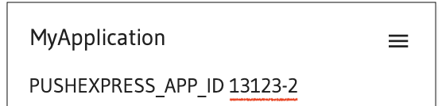

## How to use Push.Express SDK in your Android Studio project

You should already have all prerequisites from previous steps!

Push.Express SDK dependencies should be added to your project and you should have ready Push.Express App, see main guides first.

### Add required code

1. Get your `PUSHEXPRESS_APPLICATION_ID` from [Push.Express](https://push.express) account page

   

2. Set up important variables:
```kotlin
const val PUSHEXPRESS_APPLICATION_ID: String = "12345-67"
const val EXTERNAL_ID: String = "123"
const val TAGS: MutableMap<String, String> = mutableMapOf(
    "audiences" to "my_audiences_tag",
    "ad_id" to "my_ad_id_tag",
    "webmaster" to "my_webmaster_tag",
)
```
Lets break it down:
- `PUSHEXPRESS_APPLICATION_ID` \
**Requirement [MANDATORY]** \
That is an id of your Pushexpress application (refer to first point)
- `EXTERNAL_ID` \
**Requirement [OPTIONAL]** \
This id represents and id that is meaningfull for you, mostly an id of chosen client
- `TAGS` \
**Requirement [OPTIONAL]** \
Tags are needed to bind specific values to specific keys. Keys in this tag map are predefined, values, however can be modified. For example, you could set up audiences as `new_accounts` or `spent_less_than_25usd`, it is totally up to you. Setting up advertising id is not easy, you won't need it in most cases, but if you do - please contact our support [here](https://t.me/pushexpress). **Set up webmaster tag only if you use it, leave it an empty string otherwise.**

3. Make sure to handle notifications permission in your android application. The following snippet shows an example of how to do that.

```kotlin
    private fun askNotificationPermission() {
        // This is only necessary for API Level > 33 (TIRAMISU)
        if (Build.VERSION.SDK_INT >= Build.VERSION_CODES.TIRAMISU) {
            if (ContextCompat.checkSelfPermission(this,
                    android.Manifest.permission.POST_NOTIFICATIONS) ==
                PackageManager.PERMISSION_GRANTED
            ) {
                // FCM SDK (and your app) can post notifications.
            } else {
                // Directly ask for the permission
                notificationPermissionLauncher.launch(
                    android.Manifest.permission.POST_NOTIFICATIONS)
            }
        }
    }
```
4. Full code snippet
```kotlin
package com.example.myapplication

import android.content.pm.PackageManager
import android.os.Build
import android.os.Bundle
import android.widget.Toast
import androidx.activity.ComponentActivity
import androidx.activity.result.contract.ActivityResultContracts
import androidx.core.content.ContextCompat
import com.pushexpress.sdk.main.SdkPushExpress

const val PUSHEXPRESS_APPLICATION_ID: String = "12345-67"
const val EXTERNAL_ID: String = "123"
const val TAGS: MutableMap<String, String> = mutableMapOf(
    "audiences" to "my_audiences_tag",
    "ad_id" to "my_ad_id_tag",
    "webmaster" to "my_webmaster_tag",
)


class MainActivity : ComponentActivity() {
    private val pxNotificationPermissionLauncher = registerForActivityResult(
        ActivityResultContracts.RequestPermission()
    ) { isGranted: Boolean ->
        if (isGranted) {
            Toast.makeText(this, "Notifications permission granted",
                Toast.LENGTH_SHORT).show()
        } else {
            Toast.makeText(
                this,
                "FCM can't post notifications without POST_NOTIFICATIONS permission",
                Toast.LENGTH_LONG
            ).show()
        }
    }

    override fun onCreate(savedInstanceState: Bundle?) {
        super.onCreate(savedInstanceState)

        // Start of Pushexpress initialization
        pxAskNotificationPermission()

        // [MANDATORY]
        SdkPushExpress.initialize(PUSHEXPRESS_APPLICATION_ID)

        // [OPTIONAL]
        SdkPushExpress.setExternalId(EXTERNAL_ID)
        // Iterate over tags [OPTIONAL]
        TAGS.entries.map{ (name, value) ->
            SdkPushExpress.setTag(name, value)
        }
        // Or add them one by one [OPTIONAL]
        SdkPushExpress.setTag("audiences", "my_audiences_tag")
        SdkPushExpress.setTag("ad_id", "my_ad_id_tag")
        SdkPushExpress.setTag("webmaster", "my_webmaster_tag")

        // Make sure to call activate() method
        // SDK won't execute without it
        // [MANDATORY]
        SdkPushExpress.activate()
        // End of Pushexpress initialization
    }

    private fun pxAskNotificationPermission() {
        // This is only necessary for API Level >= 33 (TIRAMISU)
        if (Build.VERSION.SDK_INT >= Build.VERSION_CODES.TIRAMISU) {
            if (ContextCompat.checkSelfPermission(this,
                    android.Manifest.permission.POST_NOTIFICATIONS) ==
                PackageManager.PERMISSION_GRANTED
            ) {
                // FCM SDK (and your app) can post notifications.
            } else {
                // Directly ask for the permission
                pxNotificationPermissionLauncher.launch(
                    android.Manifest.permission.POST_NOTIFICATIONS)
            }
        }
    }
}
```