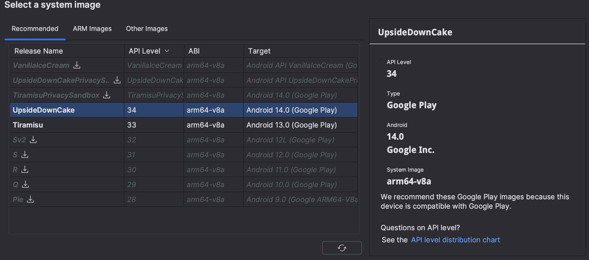
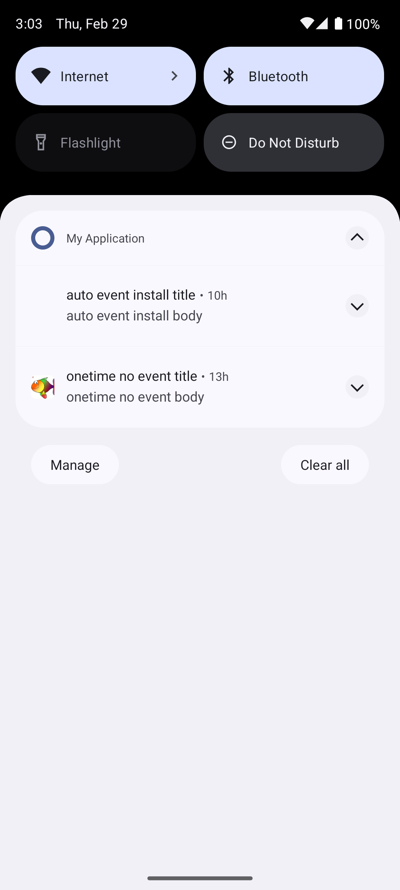
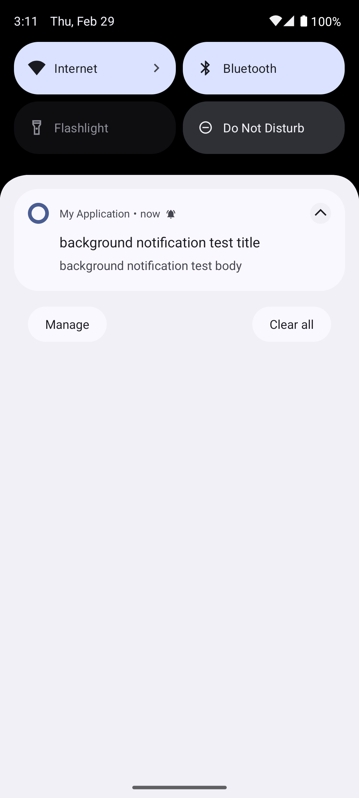

app structure:
- Android (as a root folder)
- Android/test_app (dependancy as a project)
- Android/sdk

`build.gradle.kts (root)`
```Kotlin
buildscript {
    dependencies {
        classpath("com.google.gms:google-services:4.4.1")
    }
}

plugins {
    id("com.android.library") version "8.2.2" apply false
    id("com.android.application") version "8.2.2" apply false
    id("org.jetbrains.kotlin.android") version "1.9.0" apply false
}
```

`build.gradle.kts (test_app)`
```Kotlin
plugins {
    id("com.android.application")
    id("org.jetbrains.kotlin.android")
    id("com.google.gms.google-services")
}

android {
    namespace = "com.example.myapplication"
    compileSdk = 34

    defaultConfig {
        applicationId = "com.example.myapplication"
        minSdk = 24
        targetSdk = 34
        versionCode = 1
        versionName = "1.0"

        testInstrumentationRunner = "androidx.test.runner.AndroidJUnitRunner"
        vectorDrawables {
            useSupportLibrary = true
        }
    }

    buildTypes {
        release {
            isMinifyEnabled = false
            proguardFiles(
                getDefaultProguardFile("proguard-android-optimize.txt"),
                "proguard-rules.pro"
            )
        }
    }
    compileOptions {
        sourceCompatibility = JavaVersion.VERSION_1_8
        targetCompatibility = JavaVersion.VERSION_1_8
    }
    kotlinOptions {
        jvmTarget = "1.8"
    }
    buildFeatures {
        compose = true
    }
    composeOptions {
        kotlinCompilerExtensionVersion = "1.5.1"
    }
    packaging {
        resources {
            excludes += "/META-INF/{AL2.0,LGPL2.1}"
        }
    }
}

dependencies {

    implementation("androidx.core:core-ktx:1.12.0")
    implementation("androidx.lifecycle:lifecycle-runtime-ktx:2.7.0")
    implementation("androidx.activity:activity-compose:1.8.2")
    implementation(platform("androidx.compose:compose-bom:2023.08.00"))
    implementation("androidx.compose.ui:ui")
    implementation("androidx.compose.ui:ui-graphics")
    implementation("androidx.compose.ui:ui-tooling-preview")
    implementation("androidx.compose.material3:material3")
    implementation("com.google.firebase:firebase-messaging:23.4.1")
    testImplementation("junit:junit:4.13.2")
    androidTestImplementation("androidx.test.ext:junit:1.1.5")
    androidTestImplementation("androidx.test.espresso:espresso-core:3.5.1")
    androidTestImplementation(platform("androidx.compose:compose-bom:2023.08.00"))
    androidTestImplementation("androidx.compose.ui:ui-test-junit4")
    debugImplementation("androidx.compose.ui:ui-tooling")
    debugImplementation("androidx.compose.ui:ui-test-manifest")
    implementation(project(":sdkpushexpress"))
}
```

`build.gradle.kts (sdk)`
```Kotlin
plugins {
    id("com.android.library")
    id("org.jetbrains.kotlin.android")
    id("maven-publish")
}

group = "com.pushexpress.sdk"
version = "1.2.0"

android {
    namespace = "com.pushexpress.sdk"
    compileSdk = 34

    defaultConfig {
        minSdk = 23
        buildConfigField("String", "VERSION_NAME", "\"1.2.0\"")
        testInstrumentationRunner = "androidx.test.runner.AndroidJUnitRunner"
    }
    buildFeatures {
        buildConfig = true
    }
    buildTypes {
        getByName("debug") {
            buildConfigField("boolean", "LOG_DEBUG", "true")
            buildConfigField("boolean", "LOG_RELEASE", "true")
        }
        getByName("release") {
            buildConfigField("boolean", "LOG_DEBUG", "false")
            buildConfigField("boolean", "LOG_RELEASE", "true")
            isMinifyEnabled = false
            proguardFiles(getDefaultProguardFile("proguard-android-optimize.txt"), "proguard-rules.pro")
        }
    }
    compileOptions {
        sourceCompatibility = JavaVersion.VERSION_1_8
        targetCompatibility = JavaVersion.VERSION_1_8
    }
    composeOptions {
        kotlinCompilerExtensionVersion = "1.5.1"
    }
    kotlinOptions {
        jvmTarget = "1.8"
    }
}

dependencies {
    implementation("androidx.core:core-ktx:1.12.0")
    implementation("androidx.appcompat:appcompat:1.6.1")
    implementation("com.google.android.material:material:1.11.0")
    implementation("com.google.android.gms:play-services-ads-identifier:18.0.1")
    implementation("com.google.firebase:firebase-auth-interop:20.0.0")
    implementation("org.jetbrains.kotlinx:kotlinx-coroutines-android:1.8.0")
    implementation("com.google.code.gson:gson:2.10.1")
    implementation("androidx.startup:startup-runtime:1.1.1")
    implementation("androidx.lifecycle:lifecycle-runtime-ktx:2.7.0")
    implementation("androidx.datastore:datastore-preferences:1.0.0")
    implementation("io.coil-kt:coil:2.6.0")
    testImplementation("junit:junit:4.13.2")
    androidTestImplementation("androidx.test.ext:junit:1.1.5")
    androidTestImplementation("androidx.test.espresso:espresso-core:3.5.1")

    implementation(platform("com.google.firebase:firebase-bom:32.7.2"))
    implementation("com.google.firebase:firebase-messaging-ktx")
}

//afterEvaluate {
//    publishing {
//        publications {
//            // Creates a Maven publication called "release".
//            release(MavenPublication) {
//                from components.release
//                artifactId = "pushexpress-android-sdk"
//            }
//        }
//        repositories {
//            mavenLocal()
//        }
//    }
//}
```

`settings.gradle.kts`
```Kotlin
pluginManagement {
    repositories {
        google()
        mavenCentral()
        gradlePluginPortal()
    }
}
dependencyResolutionManagement {
    repositoriesMode.set(RepositoriesMode.FAIL_ON_PROJECT_REPOS)
    repositories {
        google()
        mavenCentral()
    }
}

rootProject.name = "My Application"
include(":app")
include(":sdkpushexpress")
project(":sdkpushexpress").projectDir = file("../pushexpress-android-sdk/sdkpushexpress")
```

# Tested on a new pushexpress app 17184-1147
1. Create pushexpress app and notifcations schedule before initializing android app
2. Schedules created for every possible action/event
3. No devices are registered under this pushexpress app from the start

MainActivity.kt
```Kotlin
package com.example.myapplication

import android.content.pm.PackageManager
import android.os.Build
import android.os.Bundle
import android.widget.Toast
import androidx.activity.ComponentActivity
import androidx.activity.result.contract.ActivityResultContracts
import androidx.core.content.ContextCompat
import com.pushexpress.sdk.main.SdkPushExpress

val TAGS: MutableMap<String, String> = mutableMapOf(
    "audiences" to "test_audiences",
    "ad_id" to "random_ad_id",
    "webmaster" to "bombaster",
)
const val APPID = "17184-1147"


class MainActivity : ComponentActivity() {
    private val pxNotificationPermissionLauncher = registerForActivityResult(
        ActivityResultContracts.RequestPermission()
    ) { isGranted: Boolean ->
        if (isGranted) {
            Toast.makeText(this, "Notifications permission granted",
                Toast.LENGTH_SHORT).show()
        } else {
            Toast.makeText(
                this,
                "FCM can't post notifications without POST_NOTIFICATIONS permission",
                Toast.LENGTH_LONG
            ).show()
        }
    }

    override fun onCreate(savedInstanceState: Bundle?) {
        super.onCreate(savedInstanceState)
        pxAskNotificationPermission()
        SdkPushExpress.initialize(APPID)
        TAGS.entries.map{ (name, value) ->
            SdkPushExpress.setTag(name, value)
        }
        SdkPushExpress.activate()
    }

    private fun pxAskNotificationPermission() {
        if (Build.VERSION.SDK_INT >= Build.VERSION_CODES.TIRAMISU) {
            if (ContextCompat.checkSelfPermission(this,
                    android.Manifest.permission.POST_NOTIFICATIONS) ==
                PackageManager.PERMISSION_GRANTED
            ) {
            } else {
                pxNotificationPermissionLauncher.launch(
                    android.Manifest.permission.POST_NOTIFICATIONS)
            }
        }
    }
}
```

# Case 1: New install
[!INFO] New device api 34



## Foreground notification


Log
```
01:25:33.673  D  onMessageReceived: data={px.image=https://github.com/mohammadimtiazz/standard-test-images-for-Image-Processing/blob/master/standard_test_images/tulips.png?raw=true, px.title=onetime no event title, px.msg_id=1709158441_6662.5bd0116a-d112-4771-93ea-8be47c9402e0.0, px.fmt_ver=1, px.body=onetime no event body, px.icon=https://github.com/mohammadimtiazz/standard-test-images-for-Image-Processing/blob/master/standard_test_images/HappyFish.jpg?raw=true, px.link=}
04:22:19.988  D  onMessageReceived: from=156876172336
04:22:19.990  D  onMessageReceived: data={px.image=, px.title=auto event install title, px.msg_id=1709165568_8487 4ab19578-b3b9-4a95-9232-adac7731728e.0, px.fmt_ver=1, px.body=auto event install body, px.icon=, px.link=}
```

## Background notification


Log
```
No logs since it is handeled by firebase completely
```

## Device data updating
Log
```
15:14:50.308  D  REQUEST: PUT
                 TO: https://core.push.express/api/r/v2/apps/17184-1147/instances/43/info
                 STATUS: 200
                 RESPONSE: {"id":"43","update_interval_sec":120}
```

sql query results
```SQL
                ID: 43
            APP_ID: 17184
          IC_TOKEN: 1fd225ca-60b3-45c1-9eda-6dcd4ea3fdf8
     ID_ONE_SIGNAL: fakeid.69931d14-ba44-43d6-802f-a8d08a9bbcd5
             AD_ID: random_ad_id
        IDENTIFIER: dfLrxu-0Qp-iZYH-IkASYp:APA91bHWL9_ZvdZMnnit3QQj8dmDlAR4X6D0WfHKUPxKaDacudXwYQWmZF2IZ7BwSD8Z0M7saYULAwWTg9FR6c_L7vdfUSRGLZ9cuWEUBU-U_UVL5iW39uhYc369LVo-cA5-MnVCpCKl
   SESSESION_COUNT: 0
          LANGUAGE: en
          TIMEZONE: 3600
      GAME_VERSION:
         DEVICE_OS: android_api_34
       DEVICE_TYPE:
      DEVICE_MODEL:
              TAGS:
       LAST_ACTIVE:
          PLAYTIME: 50610
      AMOUNT_SPENT:
        CREATED_AT:
INVALID_IDENTIFIER: f
       BADGE_COUNT:
               SDK: fcm.data:android:plain_0.0.0
        LAST_HBEAT: 1709208697
      ONSCREEN_CNT: 0
         TEST_TYPE:
           COUNTRY: DE
       COUNTRY_NET: DE
       COUNTRY_SIM:
                IP:
  EXTERNAL_USER_ID:
           INSTALL: 1
      TIME_INSTALL: 1709157586
               REG: 0
          TIME_REG: 0
               DEP: 0
          TIME_DEP: 0
         AUDIENCES: test_audiences
         WEBMASTER: bombaster
      FIRST_DEVICE: 0
    SCHEDULER_SEND:
      ADDED_DEVICE: 0
```
## Device event updating
Application moved to background

Log

```
15:11:20.861  D  onActivityStopped
15:11:20.861  D  sendLifecycleEvent[background]
15:11:20.862  D  appStopped: 1709208680 4 50610
15:11:20.875  D  Send LifecycleEvent: {"event":"background"}
15:11:21.158  D  REQUEST: POST
                 TO: https://core.push.express/api/r/v2/apps/17184-1147/instances/43/events/lifecycle
                 STATUS: 202
                 RESPONSE: null
```

Application moved back to foreground

Log
```
15:24:00.840  D  onActivityResumed
15:24:00.841  D  sendLifecycleEvent[onscreen]
15:24:00.845  D  appResumed: 1709209440 5 50610
15:24:00.857  D  Send LifecycleEvent: {"event":"onscreen"}
                 DeviceConfig: {"app_id":"17184-1147","ic_token":"1fd225ca-60b3-45c1-9eda-6dcd4ea3fdf8","fcm_token":"dfLrxu-0Qp-iZYH-IkASYp:APA91bHWL9_ZvdZMnnit3QQj8dmDlAR4X6D0WfHKUPxKaDacudXwYQWmZF2IZ7BwSD8Z0M7saYULAwWTg9FR6c_L7vdfUSRGLZ9cuWEUBU-U_UVL5iW39uhYc369LVo-cA5-MnVCpCKl","install_ts":1709157769,"onscreen_cnt":5,"onscreen_sec":50610,"timezone":10800,"lang":"en","country_net":"US","country_sim":"US","ad_id":"85cb846c-ee61-4cbe-93a2-2168552ef2a2","ext_id":"","droid_api_ver":34,"sdk_ver":"1.2.0","tags":{"audiences":"test_audiences","webmaster":"bombaster","ad_id":"random_ad_id"},"transport_type":"fcm.data","transport_token":"dfLrxu-0Qp-iZYH-IkASYp:APA91bHWL9_ZvdZMnnit3QQj8dmDlAR4X6D0WfHKUPxKaDacudXwYQWmZF2IZ7BwSD8Z0M7saYULAwWTg9FR6c_L7vdfUSRGLZ9cuWEUBU-U_UVL5iW39uhYc369LVo-cA5-MnVCpCKl","platform_type":"android","platform_name":"android_api_34"}
15:24:01.673  D  REQUEST: POST
                 TO: https://core.push.express/api/r/v2/apps/17184-1147/instances/43/events/lifecycle
                 STATUS: 202
                 RESPONSE: null
```

# Case 2: Absent application id
When an app id is absent app is still making requests with an empty app id and gets 404. Not sure where exactly i need to raise an error.

Logs
```
15:42:07.147  D  SDK Initialization
15:42:07.768  D  ApiLoop iteration started
15:42:07.768  D  sendDeviceConfig
15:42:07.769  D  Generate install with new appId: 
15:42:07.792  D  onActivityResumed
15:42:07.793  D  sendLifecycleEvent[onscreen]
15:42:07.802  D  appResumed: 1709210527 1 0
15:42:07.824  D  Send LifecycleEvent: {"event":"onscreen"}
15:42:08.068  D  POST exception: java.net.ConnectException: Failed to connect to core.push.express/[2a06:98c1:3120::3]:443
15:42:08.068  D  getInstanceId exception: org.json.JSONException: End of input at character 0 of 
15:42:08.072  D  POST exception: java.net.ConnectException: Failed to connect to core.push.express/[2a06:98c1:3120::3]:443
15:42:08.073  D  getInstanceId exception: org.json.JSONException: End of input at character 0 of 
15:42:08.096  D  POST exception: java.net.ConnectException: Failed to connect to core.push.express/[2a06:98c1:3120::3]:443
15:42:11.600  D  Send
                 DeviceConfig: {"app_id":"","ic_token":"5dc95166-fea0-4cb2-bb1a-628a3b5cbf8d","fcm_token":"","install_ts":1709210527,"onscreen_cnt":1,"onscreen_sec":0,"timezone":10800,"lang":"en","country_net":"US","country_sim":"US","ad_id":"0a68386e-d98e-40f2-b44b-348cca6eaec3","ext_id":"","droid_api_ver":34,"sdk_ver":"1.2.0","tags":{"audiences":"test_audiences","ad_id":"random_ad_id","webmaster":"bombaster"},"transport_type":"fcm.data","transport_token":"","platform_type":"android","platform_name":"android_api_34"}
15:42:12.730  D  REQUEST: POST
                 TO: https://core.push.express/api/r/v2/apps//instances
                 STATUS: 404
                 RESPONSE: 404 page not found
15:42:12.730  D  getInstanceId exception: org.json.JSONException: Value 404 of type java.lang.Integer cannot be converted to JSONObject
15:42:13.133  D  REQUEST: PUT
                 TO: https://core.push.express/api/r/v2/apps//instances/kotlin.Unit/info
                 STATUS: 404
                 RESPONSE: 404 page not found
15:42:13.133  D  ApiLoop: unhandled error: org.json.JSONException: Value 404 of type java.lang.Integer cannot be converted to JSONObject
```

# Case 3: Wrong application id
Same as with absent app id

Logs
```
15:48:55.832  D  SDK Initialization
15:48:56.000  D  ApiLoop iteration started
15:48:56.001  D  Generate install with new appId: 3323424124
15:48:56.002  D  sendDeviceConfig
15:48:56.050  D  onActivityResumed
15:48:56.060  D  sendLifecycleEvent[onscreen]
15:48:56.063  D  appResumed: 1709210936 1 0
15:48:56.076  D  Send LifecycleEvent: {"event":"onscreen"}
15:48:56.293  D  getFirebaseToken: token=fSAbAl2mRYSmkrDqG-wVfb:APA91bE4-l-mylkTZO9KDxdWRuR5nOJyvsYY8vHENs8eV9Pwmkkndda-hVTYVKGzTONxlytvM6elpBWd-YXKQnDIksAJrw2Fn8U2O8_2qSYbHZBeXxkU4P6opXCj_bMxpYiELvsgPoyi
15:48:56.295  D  saveFirebaseToken: saved to settings
15:48:56.324  D  Send
                 DeviceConfig: {"app_id":"3323424124","ic_token":"ccca8b05-b00a-40e5-8ef2-4e8302843595","fcm_token":"fSAbAl2mRYSmkrDqG-wVfb:APA91bE4-l-mylkTZO9KDxdWRuR5nOJyvsYY8vHENs8eV9Pwmkkndda-hVTYVKGzTONxlytvM6elpBWd-YXKQnDIksAJrw2Fn8U2O8_2qSYbHZBeXxkU4P6opXCj_bMxpYiELvsgPoyi","install_ts":1709210936,"onscreen_cnt":1,"onscreen_sec":0,"timezone":10800,"lang":"en","country_net":"US","country_sim":"US","ad_id":"0a68386e-d98e-40f2-b44b-348cca6eaec3","ext_id":"","droid_api_ver":34,"sdk_ver":"1.2.0","tags":{"audiences":"test_audiences","ad_id":"random_ad_id","webmaster":"bombaster"},"transport_type":"fcm.data","transport_token":"","platform_type":"android","platform_name":"android_api_34"}
15:48:57.019  D  REQUEST: POST
                 TO: https://core.push.express/api/r/v2/apps/3323424124/instances
                 STATUS: 400
                 RESPONSE: {"type":"problem-types/request-parse-error","title":"Request parse error","status":400,"detail":"can't parse app_id
                 '3323424124'","instance":"/api/v2/apps/:uappId/instances"}
15:48:57.019  D  getInstanceId exception: org.json.JSONException: No value for id
15:48:57.044  D  REQUEST: POST
                 TO: https://core.push.express/api/r/v2/apps/3323424124/instances
                 STATUS: 400
                 RESPONSE: {"type":"problem-types/request-parse-error","title":"Request parse error","status":400,"detail":"can't parse app_id
                 '3323424124'","instance":"/api/v2/apps/:uappId/instances"}
15:48:57.045  D  getInstanceId exception: org.json.JSONException: No value for id
15:48:57.090  D  REQUEST: POST
                 TO: https://core.push.express/api/r/v2/apps/3323424124/instances
                 STATUS: 400
                 RESPONSE: {"type":"problem-types/request-parse-error","title":"Request parse error","status":400,"detail":"can't parse app_id
                 '3323424124'","instance":"/api/v2/apps/:uappId/instances"}
```